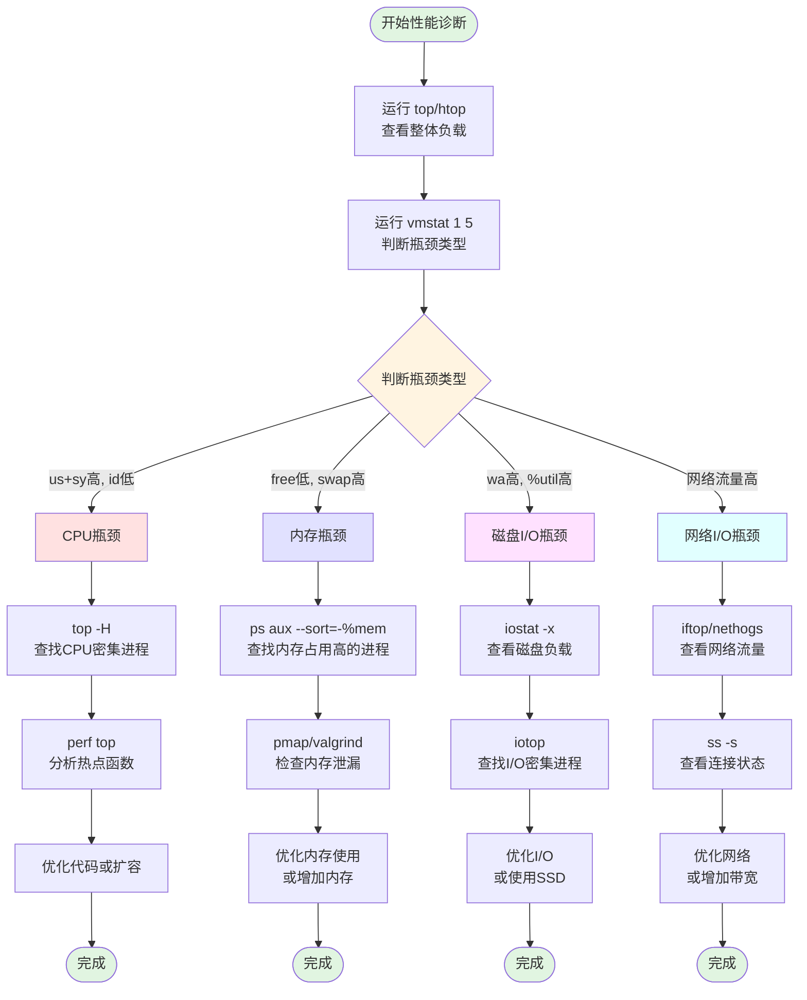

# Linux 性能瓶颈诊断

## 概述

性能瓶颈通常出现在以下四个方面：

1. **CPU** - 计算密集型任务
2. **内存** - 内存不足或泄漏
3. **磁盘 I/O** - 读写频繁
4. **网络 I/O** - 网络传输瓶颈

## 快速诊断流程

### 第一步：整体系统负载查看

```bash
# 查看系统整体负载（最常用）
top

# 更友好的交互式工具
htop

# 查看系统平均负载
uptime
# 输出示例：up 10 days, 2 users, load average: 0.50, 0.40, 0.35
# 三个数字分别代表 1分钟、5分钟、15分钟 的平均负载
# 负载值 > CPU核心数 表示系统过载
```

**load average 解读**：

- 单核 CPU：负载 > 1.0 表示过载
- 4核 CPU：负载 > 4.0 表示过载
- 负载持续增长说明系统压力在增大

### 第二步：确定瓶颈类型

使用 `vmstat` 快速判断：

```bash
vmstat 1 5
# 每秒输出一次，共5次

# 输出示例：
# procs -----------memory---------- ---swap-- -----io---- -system-- ------cpu-----
#  r  b   swpd   free   buff  cache   si   so    bi    bo   in   cs us sy id wa st
#  2  0      0 500000  50000 800000    0    0    10    20  100  200 25  5 70  0  0
```

**关键指标解读**：


| 列      | 含义                            | 瓶颈判断                |
| ------- | ------------------------------- | ----------------------- |
| `r`     | 运行队列长度（等待CPU的进程数） | > CPU核心数 → CPU瓶颈   |
| `b`     | 不可中断睡眠的进程数（等待I/O） | > 0 持续存在 → I/O瓶颈  |
| `si/so` | 换入/换出内存（KB/s）           | > 0 持续存在 → 内存不足 |
| `bi/bo` | 块设备读入/写出（块/s）         | 很高 → 磁盘I/O瓶颈      |
| `us`    | 用户态CPU使用率                 | > 70% → CPU密集型       |
| `sy`    | 系统态CPU使用率                 | > 30% → 系统调用频繁    |
| `wa`    | I/O等待CPU占比                  | > 20% → I/O瓶颈         |
| `id`    | 空闲CPU                         | < 10% → CPU瓶颈         |

## 一、CPU 瓶颈诊断

### 1.1 查看 CPU 使用率

```bash
# 实时查看 CPU 使用情况
top
# 按 '1' 显示每个CPU核心
# 按 'P' 按CPU使用率排序

# 查看每个CPU核心使用率
mpstat -P ALL 1
# 输出每个核心的 %usr, %sys, %iowait, %idle

# 查看进程级别的CPU使用
ps aux --sort=-%cpu | head -10
# 显示CPU使用率最高的10个进程
```

### 1.2 查找CPU密集型进程

```bash
# 找出CPU占用最高的进程
top -b -n 1 | head -20

# 查看具体进程的线程CPU使用情况
top -H -p <PID>

# 使用 pidstat 查看进程CPU统计
pidstat -u 1 5
# -u: CPU使用率
# 1: 每秒采样
# 5: 采样5次
```

### 1.3 分析CPU瓶颈原因

```bash
# 查看进程的系统调用
strace -c -p <PID>
# -c: 统计系统调用次数和时间
# -p: 指定进程ID

# 查看进程的函数调用栈（需要安装 perf）
perf top -p <PID>

# 生成火焰图（需要安装 FlameGraph）
perf record -F 99 -p <PID> -g -- sleep 30
perf script | stackcollapse-perf.pl | flamegraph.pl > cpu-flamegraph.svg
```

**CPU瓶颈判断标准**：

- `us + sy > 80%` 且 `id < 20%` → CPU瓶颈
- `us` 很高 → 应用程序计算密集
- `sy` 很高 → 系统调用频繁，可能是大量小文件操作或网络连接

### 1.4 CPU 上下文切换分析

```bash
# 查看上下文切换次数
vmstat 1
# cs 列：每秒上下文切换次数
# 正常值：< 10000
# 异常值：> 100000 说明线程/进程切换频繁

# 查看每个进程的上下文切换
pidstat -w 1 5
# cswch/s: 自愿上下文切换（进程主动放弃CPU）
# nvcswch/s: 非自愿上下文切换（时间片用完被强制切换）
```

## 二、内存瓶颈诊断

### 2.1 查看内存使用情况

```bash
# 查看内存概况
free -h
# 输出示例：
#               total        used        free      shared  buff/cache   available
# Mem:           15Gi       8.0Gi       2.0Gi       500Mi       5.0Gi       6.5Gi
# Swap:         2.0Gi       100Mi       1.9Gi

# 详细内存信息
cat /proc/meminfo

# 实时监控内存
watch -n 1 free -h
```

**内存指标解读**：

- `available` < 总内存的 10% → 内存紧张
- `Swap used` > 0 且持续增长 → 内存不足
- `buff/cache` 很高是正常的（Linux会用空闲内存做缓存）

### 2.2 查找内存占用高的进程

```bash
# 按内存使用率排序
ps aux --sort=-%mem | head -10

# 使用 top 查看
top
# 按 'M' 按内存使用率排序

# 查看进程内存详细信息
pmap -x <PID>

# 查看进程内存映射
cat /proc/<PID>/smaps
```

### 2.3 内存泄漏检测

```bash
# 持续监控进程内存增长
while true; do
    ps aux | grep <进程名> | grep -v grep
    sleep 5
done

# 使用 valgrind 检测内存泄漏（需要重启应用）
valgrind --leak-check=full --log-file=valgrind.log ./your_program

# 使用 pidstat 监控内存
pidstat -r 1
# VSZ: 虚拟内存大小
# RSS: 物理内存大小
# %MEM: 内存使用百分比
```

### 2.4 查看 Swap 使用情况

```bash
# 查看 swap 使用
swapon --show

# 查看哪些进程在使用 swap
for file in /proc/*/status ; do
    awk '/VmSwap|Name/{printf $2 " " $3}END{ print ""}' $file
done | sort -k 2 -n -r | head -10

# 清理 swap（谨慎使用）
# swapoff -a && swapon -a
```

**内存瓶颈判断标准**：

- 可用内存 < 10% → 内存不足
- Swap 使用率 > 50% → 严重内存不足
- 进程频繁被 OOM Killer 杀死 → 内存耗尽

## 三、磁盘 I/O 瓶颈诊断

### 3.1 查看磁盘 I/O 统计

```bash
# 查看磁盘I/O统计（最常用）
iostat -x 1 5
# -x: 显示扩展统计
# 1: 每秒采样
# 5: 采样5次

# 输出示例：
# Device    r/s   w/s   rkB/s   wkB/s  %util
# sda      10.0  20.0   100.0   200.0   85.0
```

**关键指标解读**：

| 指标    | 含义                | 瓶颈判断                    |
| ------- | ------------------- | --------------------------- |
| `r/s`   | 每秒读请求数        | 机械硬盘 > 100, SSD > 10000 |
| `w/s`   | 每秒写请求数        | 机械硬盘 > 100, SSD > 10000 |
| `await` | 平均I/O等待时间(ms) | > 20ms 说明I/O慢            |
| `svctm` | 平均服务时间(ms)    | > 10ms 说明磁盘慢           |
| `%util` | 磁盘繁忙程度        | > 80% → I/O瓶颈             |

### 3.2 查找磁盘 I/O 密集型进程

```bash
# 查看进程I/O统计（需要root权限）
iotop
# 按 'o' 只显示有I/O的进程
# 按 'a' 显示累计I/O

# 使用 pidstat 查看进程I/O
pidstat -d 1 5
# kB_rd/s: 每秒读取KB数
# kB_wr/s: 每秒写入KB数

# 查看进程打开的文件
lsof -p <PID>

# 查看进程的I/O统计
cat /proc/<PID>/io
```

### 3.3 分析磁盘性能

```bash
# 测试磁盘读性能
hdparm -t /dev/sda

# 测试磁盘写性能
dd if=/dev/zero of=/tmp/test bs=1M count=1024 oflag=direct
# 注意：会创建1GB文件

# 查看磁盘队列深度
cat /sys/block/sda/queue/nr_requests

# 查看文件系统统计
df -h
df -i  # 查看 inode 使用情况
```

### 3.4 查看具体文件的 I/O

```bash
# 实时监控文件访问
inotifywait -m /path/to/directory

# 查看哪些进程在访问某个文件
lsof /path/to/file

# 查看目录下文件大小
du -sh /path/to/directory/*
```

**磁盘I/O瓶颈判断标准**：

- `%util > 80%` → 磁盘繁忙
- `await > 20ms` → I/O响应慢
- `vmstat` 中 `wa > 20%` → CPU等待I/O时间过长

## 四、网络 I/O 瓶颈诊断

### 4.1 查看网络流量

```bash
# 实时查看网络流量（需要安装）
iftop

# 查看网络接口统计
ifconfig
# 或
ip -s link

# 持续监控网络流量
watch -n 1 'cat /proc/net/dev'

# 使用 sar 查看网络统计
sar -n DEV 1 5
# rxkB/s: 每秒接收KB数
# txkB/s: 每秒发送KB数
```

### 4.2 查看网络连接

```bash
# 查看所有网络连接
netstat -antp
# 或使用更快的 ss
ss -antp

# 查看连接数统计
netstat -n | awk '/^tcp/ {++S[$NF]} END {for(a in S) print a, S[a]}'
# 输出各种状态的连接数：ESTABLISHED, TIME_WAIT, CLOSE_WAIT 等

# 查看监听端口
ss -lntp

# 查看某个端口的连接
ss -antp | grep :80
```

### 4.3 查找网络密集型进程

```bash
# 查看进程的网络连接
lsof -i -P -n
# -i: 网络连接
# -P: 显示端口号
# -n: 不解析主机名

# 查看特定进程的网络连接
lsof -i -P -n -p <PID>

# 使用 nethogs 查看进程网络使用（需要安装）
nethogs

# 查看进程的网络统计
cat /proc/<PID>/net/dev
```

### 4.4 网络性能测试

```bash
# 测试网络带宽（需要在两台机器上安装 iperf3）
# 服务端：
iperf3 -s

# 客户端：
iperf3 -c <服务器IP>

# 测试网络延迟
ping -c 10 <目标IP>

# 追踪路由
traceroute <目标IP>

# 查看网络丢包和错误
netstat -i
# RX-ERR: 接收错误
# TX-ERR: 发送错误
# RX-DRP: 接收丢包
# TX-DRP: 发送丢包
```

### 4.5 TCP 连接状态分析

```bash
# 查看 TCP 连接状态统计
ss -s

# 查看 TIME_WAIT 连接数
ss -ant | grep TIME_WAIT | wc -l

# 查看 CLOSE_WAIT 连接数（如果很多说明应用没有正确关闭连接）
ss -ant | grep CLOSE_WAIT | wc -l

# 查看 TCP 重传
netstat -s | grep retransmit
```

**网络瓶颈判断标准**：

- 网络流量接近带宽上限 → 带宽瓶颈
- `TIME_WAIT` 连接数 > 10000 → 短连接过多
- `CLOSE_WAIT` 连接数持续增长 → 应用未正确关闭连接
- 丢包率 > 1% → 网络质量问题

## 五、综合诊断工具

### 5.1 dstat - 综合监控工具

```bash
# 安装
yum install dstat  # CentOS/RHEL
apt install dstat  # Ubuntu/Debian

# 综合查看 CPU、内存、磁盘、网络
dstat -cdngy
# -c: CPU
# -d: 磁盘
# -n: 网络
# -g: 页面统计
# -y: 系统统计

# 每秒更新，显示最繁忙的进程
dstat -c --top-cpu -d --top-bio
```

### 5.2 sar - 系统活动报告

```bash
# 查看历史CPU使用率
sar -u 1 10

# 查看历史内存使用
sar -r 1 10

# 查看历史磁盘I/O
sar -d 1 10

# 查看历史网络流量
sar -n DEV 1 10

# 查看今天的所有统计
sar -A
```

### 5.3 perf - 性能分析工具

```bash
# 查看系统整体性能事件
perf stat -a sleep 10

# 记录性能数据
perf record -a -g -- sleep 10

# 查看性能报告
perf report

# 实时查看热点函数
perf top
```

### 5.4 nmon - 综合性能监控

```bash
# 安装
wget http://sourceforge.net/projects/nmon/files/nmon_linux_x86_64.tar.gz
tar -xvf nmon_linux_x86_64.tar.gz

# 运行
./nmon

# 交互式按键：
# c: CPU
# m: 内存
# d: 磁盘
# n: 网络
# t: 进程
```

## 六、性能瓶颈诊断流程图



## 七、常见性能问题和解决方案

### 7.1 CPU 100% 问题

**诊断**：

```bash
top  # 找到CPU占用高的进程
top -H -p <PID>  # 查看线程级别
perf top -p <PID>  # 查看热点函数
```

**常见原因**：

- 死循环
- 正则表达式回溯
- 大量计算
- 频繁的 GC（Java应用）

### 7.2 内存泄漏问题

**诊断**：

```bash
# 持续监控内存增长
watch -n 5 'ps aux | grep <进程名>'

# 查看进程内存映射
pmap -x <PID>

# 使用 valgrind
valgrind --leak-check=full ./program
```

**常见原因**：

- 未释放的对象引用
- 缓存无限增长
- 文件句柄未关闭

### 7.3 磁盘 I/O 慢问题

**诊断**：

```bash
iostat -x 1  # 查看 %util 和 await
iotop  # 找到I/O密集进程
```

**常见原因**：

- 频繁的小文件读写
- 没有使用缓存
- 磁盘碎片化
- RAID 配置不当

### 7.4 网络延迟问题

**诊断**：

```bash
ping <目标IP>  # 测试延迟
traceroute <目标IP>  # 追踪路由
ss -s  # 查看连接状态
```

**常见原因**：

- 网络拥塞
- DNS 解析慢
- 连接池配置不当
- TIME_WAIT 连接过多

## 八、性能优化建议

### 8.1 CPU 优化

- 减少不必要的计算
- 使用缓存避免重复计算
- 多线程/多进程并行处理
- 使用更高效的算法和数据结构

### 8.2 内存优化

- 及时释放不用的对象
- 使用对象池减少分配
- 限制缓存大小
- 使用内存映射文件处理大文件

### 8.3 磁盘 I/O 优化

- 使用缓存减少磁盘访问
- 批量读写代替频繁小I/O
- 使用 SSD 代替机械硬盘
- 使用异步 I/O

### 8.4 网络 I/O 优化

- 使用连接池
- 启用 TCP keepalive
- 调整 TCP 参数（窗口大小、队列长度）
- 使用 CDN 加速静态资源

## 九、快速参考命令

```bash
# 一键查看系统性能概况
echo "=== CPU ===" && top -b -n 1 | head -20 && \
echo "=== Memory ===" && free -h && \
echo "=== Disk ===" && df -h && \
echo "=== Network ===" && ss -s && \
echo "=== Load ===" && uptime

# 保存性能数据用于分析
sar -A > sar_report.txt

# 生成性能报告
perf record -a -g -- sleep 30
perf report > perf_report.txt
```

## 总结

性能瓶颈诊断关键：

1. **先整体后局部**：先用 top/vmstat 看整体，再用专项工具深入
2. **看趋势不看瞬时值**：持续监控一段时间，观察趋势
3. **结合业务场景**：性能指标要结合实际业务负载分析
4. **量化指标**：用具体数据说话，凭感觉容易事倍功半

记住这个口诀：

- **CPU看 top**
- **内存看 free**
- **磁盘看 iostat**
- **网络看 iftop**
- **综合看 vmstat**
